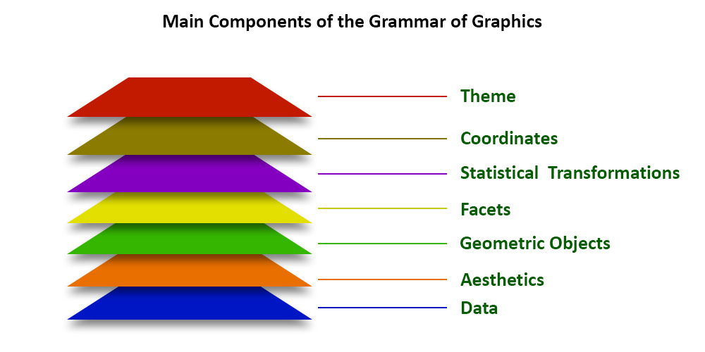

# Introduktion til datavisualisering i R med ggplot2
**ggplot2** er nok den mest brugte datavisualisering R-pakke. 

Årsagen til dette er de mange muligheder du har med **ggplot2**.

På dette webinar får du en introduktion til, hvordan du kan komme i gang med at præsentere dine data med **ggplot2** i R.

## The grammar of graphics
**ggplot2** er baseret på "The grammar of graphics", ideen
at du kan bygge alle plot ud fra de samme 7 lag:

- Theme
- Coordinates
- Statistics
- Facets
- Geometries
- Aesthetics
- Data

# Data
Link til data

# RStudio
Jeg brugere RStudio som IDE, *du kan godt bruge andre IDE'er*

RStudio er Open Source og nok det mest brugte IDE til R programmering.

Du kan hente den nyeste version her - [cran.rstudio.com](https://cran.rstudio.com)

## Online RStudio
Det er også muligt at bruge RStude i en online version, se mere her - [https://rstudio.cloud](https://rstudio.cloud)

# Slides
Link til mine slides - 

# Agenda
- Installation
- [R packages](./r-packages.md)
- [Hent data]()
- [The grammar of graphics]()

# Links
- [ggplot2.tidyverse.org](https://ggplot2.tidyverse.org)
- [ggplot2-book.org](https://ggplot2-book.org)
- [www.rdocumentation.org/packages/ggplot2](https://www.rdocumentation.org/packages/ggplot2)
- [R Graphics Cookbook](https://r-graphics.org/)
- [Cheat Sheet](https://github.com/rstudio/cheatsheets/blob/main/data-visualization.pdf)