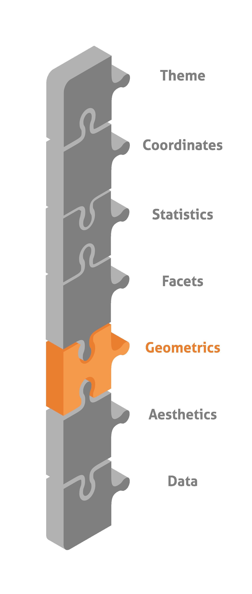
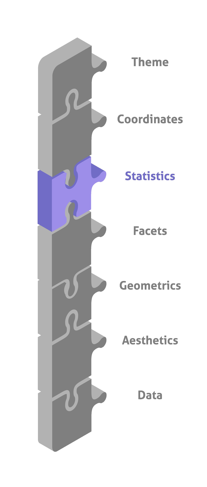

<!-- _color: white -->
# Introduktion til datavisualisering i R med<!-- fit -->
# ggplot2 <!-- fit -->
## Webinar 23-11-2022 - Tue Hellstern

---


# Tue Hellstern

- Uddannet fra ITU
- Ekstern lektor på DTU
- Lektor på KEA
- Censor på Datamatiker, Akademiuddannelserne, PBA, Økonomi & IT og andre uddannelser

### Konsulent
- Selvstændig siden 1995
- Programmering, Databaser, Integration, Projekt styring
- Typisk større virksomheder

---


# Agenda
- Introduktion til RStudio
    - Lokalt/Online
- Introduktion til ggplot2
    -  Grammar of Graphics
- Packages
- Opret et plot ud fra *Grammar of Graphics*


---


# Hvem er I?

Erfaring med R
    < 1 år
    1 til 4 år
    > 4 år
Kender RStudio - Ja/Nej
Har brugt ggplot2 - Ja/Nej

---


# RStudio

---


# ggplot2

ggplot2 er et system til oprettelse af plot/diagrammer, baseret på **The Grammar of Graphics**. 

Du leverer dataene, fortæller **ggplot2**, hvordan variabler skal vises, hvilke typer plot der skal bruges, og **ggplot2** tager sig af detaljerne.

---

# Pakker
Vi skal bruge nogle pakker for at tilpasse data og oprette plot.

```r
install.packages('tidyverse')
install.packages('lubridate')

library(ggplot2)
library(lubridate)
```

---


# Data
Til dette plot er det et af de *indbyggede* datasæt vi brugere - **airquality**

Dette dataset viser daglige målinger af luftkvaliteten i New York. I perioden maj til september 1973.

---

# Grammar of Graphics


---


#  Data laget
Du indlæser datasættet **airquality** med denne R kode:

```r
ggplot(data = airquality)
```

---

# Data tilpasning
Typisk kan data ikke bruges i den form du importere dem, hvilket også gælder her. Vi skal have tilpasset følgende:

- Konverter **Month** til en *Factor*
- Tilføj en kolonne med ugedag (*Weekday*)
- Tilføj en kolonne med månedsnavn (*Monthname*)
- Fjern tomme værdier (*NA*)

---


# Datatyper
Du kan bruge denne R kommando til at se hvilke data typer dine data har:

```r
str(airquality)
```
---

### Factor - Month
Vi vil gerne have konverteret kolonnen **Month** til en *Factor*

```r
airquality$Month <- factor(airquality$Month)
```
**Factor** er *værdier*, du kan bruge til at kategorisere dine dataene og gemme dem som niveauer. **Factor** er nyttige i de kolonner, som har et begrænset antal unikke værdier. For eksempel "*Mand*, "*Kvinde*" og *True*, *False* osv. **Factor** bruges meget i dataanalyse til statistisk modellering. En **Factor** kan være både *strenge* og *heltal*.

---

# Tilføj ugedag
Jeg vil gerne have mulighed for at gruppere efter ugedag. Problemet er at datasættet "*kun*" indeholder **Day** og **Month**. Året kender vi - **1973**.

Det kan løses med lidt R programmering

```r
airquality$Weekday <- c(wday(paste(airquality$Day, airquality$Month, '1973', sep='-'), label=TRUE, abbr=FALSE))
```

---

# Tilføj månedsnavn

```r
airquality$Monthname <- month.abb[airquality$Month]
```

---

# Fjern NA værdier
I datasættet er der en del NA værdier, den skal vi have fjernet. Det kan du nemt gøre med denne R kommando

```r
airquality <- na.omit(airquality)
```
**na.omit** fjerner rows der indeholder **en** eller **flere** **NA** værdier

---


# Aesthetics
Her betyder **Aesthetic**  "*Noget du kan se*". Det er godt nok kun baggrund osv. du kan se **ikke** "*data*". 

Det er fundamentet for dit plot.

```r
ggplot(data = airquality,
    aes(x = Temp, y = Ozone, col = Temp))
```

---



# Geometris
*Nu sker der noget*, her vælger du hvilken plot "*type*" du vil vise.


---

```r
ggplot(data = airquality, 
    aes(x = Ozone, y = Temp)) + 
  geom_point()
```


---

# Tilføj Color til Geometric layer

```r
ggplot(data = airquality, 
       aes(x = Ozone, y = Temp, 
           col = Month)) + 
  geom_point()
```
---

# Tilføj Size til Geometric layer

```r
ggplot(data = airquality, 
    aes(x = Ozone, y = Temp, 
        size = Month)) + 
  geom_point()
```
---

# Tilføj Shape og Color til Geometric layer

```r
ggplot(data = airquality, 
       aes(x = Ozone, y = Temp, 
           col = Month, 
           shape = Month)) + 
  geom_point()
```

---

# Shape, Color og Size til Geometric layer

```r
ggplot(data = airquality, 
       aes(x = Ozone, y = Temp, 
           col = Month,
           size = Wind, 
           shape = Month)) + 
  geom_point()
```

---


# Facets
```r
p <- ggplot(data = airquality, 
       aes(x = Ozone, y = Temp,
           col = Month,
           shape = Month)) + 
  geom_point()
```

---


# Opdel i rækker efter Måned (Month)

```r
p + facet_grid(Month ~ .)
```

---


# Opdel i koloner efter Ugedag (Weekday)

```r
p + facet_grid(. ~ Weekday)
```

---



# Statistics

---


```r
ggplot(data = airquality, 
       aes(x = Ozone, y = Temp,
           col = Monthname)) +
  geom_point() +
  geom_smooth(se = T, method = lm)
```

---

```r
ggplot(data = airquality, 
       aes(x = Ozone, y = Temp,
           col = Monthname)) +
  geom_point() +
  geom_smooth(se = T, method = lm, col = 'red')
```

---

# coord_cartesian() - xlim =

```r
ggplot(data = airquality, 
       aes(x = Ozone, y = Temp,
           col = Monthname)) +
  geom_point() +
  geom_smooth(se = F) +
  coord_cartesian(xlim = c(10, 20))
```

---


# Coordinates

---


# Theme

```r
ggplot(data = airquality, 
       aes(x = Ozone, y = Temp, 
           col = Monthname)) + 
  geom_point() + 
  geom_smooth(se = F, method = lm) +
  theme(plot.background = element_rect(fill = 'ligh
```

---


# Links
- [ggplot2.tidyverse.org](https://ggplot2.tidyverse.org)
- [ggplot2-book.org](https://ggplot2-book.org)
- [www.rdocumentation.org/packages/ggplot2](https://www.rdocumentation.org/packages/ggplot2)
- [R Graphics Cookbook](https://r-graphics.org/)
- [Cheat Sheet](https://github.com/rstudio/cheatsheets/blob/main/data-visualization.pdf)