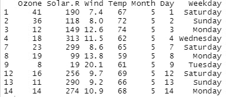

# The Grammar of Graphics
Opret et plot i **ggplot2** i forhold til de 7 lag i "*The Grammar of Graphics*"

# 1. Data Layer
I **datalaget** definerer du det data der skal bruges til oprettelsen af dit plot.

Til dette plot er det et af de *indbyggede* datasæt vi brugere - **airquality**

Dette dataset viser daglige målinger af luftkvaliteten i New York. I perioden maj til september 1973.

Datasættet består af 6 kolonner og 153 rækker

| Navn    | Datatype | Beskrivelse               |
|---------|----------|---------------------------|
| Ozone   | int      | Ozone (ppb)               |
| Solar.R | int      | Solar                     |
| Wind    | num      | Vind hastighed (mph)      |
| Temp    | int      | Temperatur i Fahrenheit   |
| Month   | int      | Måneder vist som 1 til 12 |
| Day     | int      | Dage vist som 1 til 31    |

Du indlæser datasættet **airquality** med denne R kode:

```r
ggplot(data = airquality)
```
## Tilpasning af data
Der skal fortages nogle tilpasninger af data

- Month skal konverteres til enFactor
- Der skal oprettes en ny kolonne der indeholder **ugedag**(*Weekday*)
- Tomme/Manglende (NA) værdier skal fjernes

### Month - Factor
Vi skal have konverteret kolonnen **Month** til en *Factor*

```r
airquality$Month <- factor(airquality$Month)
```

### Ugedag
Datasættet indeholder en **dag** (*1 til 31*) og en **måned** (*1-12*), vi ved at alle data er opsamlet i 1973. Ud fra de oplysninger opretter vi en ny kolonne - **Weekday**.

```r
airquality$Weekday <- c(wday(paste(airquality$Day, airquality$Month, '1973', sep='-'), label=TRUE, abbr=FALSE))
```

# 2. Aesthetic Layer

```r
ggplot(data = airquality,
    aes(x = Temp, y = Ozone, col = Temp))
```

# 3. Geometric layer

```r
ggplot(data = airquality, 
    aes(x = Ozone, y = Temp)) + 
  geom_point()
```

## Tilføj Color til Geometric layer

```r
ggplot(data = airquality, 
       aes(x = Ozone, y = Temp, 
           col = Month)) + 
  geom_point()
```

## Tilføj Size til Geometric layer

```r
ggplot(data = airquality, 
    aes(x = Ozone, y = Temp, 
        size = Month)) + 
  geom_point()
```

## Tilføj Shape og Color til Geometric layer

```r
ggplot(data = airquality, 
       aes(x = Ozone, y = Temp, 
           col = Month, 
           shape = Month)) + 
  geom_point()
```

## Shape, Color og Size

```r
ggplot(data = airquality, 
       aes(x = Ozone, y = Temp, 
           col = Month,
           size = Wind, 
           shape = Month)) + 
  geom_point()
```

# 4. Facet layer

```r
p <- ggplot(data = airquality, 
       aes(x = Ozone, y = Temp,
           col = Month,
           shape = Month)) + 
  geom_point()
```

## Opdel i rækker efter Måned (Month)

```r
p + facet_grid(Month ~ .)
```

## Opdel i koloner efter Ugedag (Weekday)

```r
p + facet_grid(. ~ Weekday)
```

# 5. Statistics


# 6. Theme


# Coordinates


# Themes