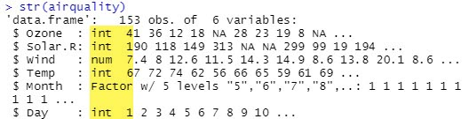

# The Grammar of Graphics
Opret et plot i **ggplot2** i forhold til de 7 lag i "*The Grammar of Graphics*"

# Pakker
Vi skal bruge nogle pakker for at tilpasse data og oprette plot.

```r
install.packages('tidyverse')
install.packages('lubridate')

library(ggplot2)
library(lubridate)
```

Du kan installere disse pakker via ovenstående kode eller via det grafiske miljø i RStudio.


# Data Layer
I **datalaget** definerer du det data der skal bruges til oprettelsen af dit plot.

Til dette plot er det et af de *indbyggede* datasæt vi brugere - **airquality**

Dette dataset viser daglige målinger af luftkvaliteten i New York. I perioden maj til september 1973.

Datasættet består af 6 kolonner og 153 rækker

| Navn    | Datatype | Beskrivelse               |
|---------|----------|---------------------------|
| Ozone   | int      | Ozone (ppb)               |
| Solar.R | int      | Solar                     |
| Wind    | num      | Vind hastighed (mph)      |
| Temp    | int      | Temperatur i Fahrenheit   |
| Month   | int      | Måneder vist som 1 til 12 |
| Day     | int      | Dage vist som 1 til 31    |

Du indlæser datasættet **airquality** med denne R kode:

```r
ggplot(data = airquality)
```


## Data tilpasning
Typisk kan data ikke bruges i den form du importere dem, hvilket også gælder her. Vi skal have tilpasset følgende:

- Konverter **Month** til en *Factor*
- Tilføj en kolonne med ugedag (*weekday*)
- Fjern tomme værdier (*NA*)

### Factor - Month
Vi vil gerne have konverteret kolonnen **Month** til en *Factor*

```r
airquality$Month <- factor(airquality$Month)
```
**Factor** er *værdier*, du kan bruge til at kategorisere dine dataene og gemme dem som niveauer. **Factor** er nyttige i de kolonner, som har et begrænset antal unikke værdier. For eksempel "*Mand*, "*Kvinde*" og *True*, *False* osv. **Factor** bruges meget i dataanalyse til statistisk modellering. En **Factor** kan være både *strenge* og *heltal*.

Du kan bruge denne R kommando til at se hvilke data typer dine data har:

```r
str(airquality)
```



### Tilføj ugedag
Jeg vil gerne have mulighed for at gruppere efter ugedag. Problemet er at datasættet "kun" indeholder **Day** og **Month**. Året kender vi - **1973**.

Det kan løses med lidt R programmering

```r
airquality$Weekday <- c(wday(paste(airquality$Day, airquality$Month, '1973', sep='-'), label=TRUE, abbr=FALSE))
```

Det jeg gør er følgende:

- Tilføj en ny kolonne - **Weekday** - *airquality$Weekday*
- Henter felterne **Day** og **Month** og sætter dem sammen med året **1973**, imellem de tre felter indsætter jeg **sep = '-'** - *paste(airquality$Day, airquality$Month, '1973', sep='-')*
- Finder **Weekday** ud fra den dato jeg lige har *skabt*. Til det bruger jeg pakken **lubridate** og kommandoen **wday**

### Fjern NA værdier
I datasættet er der en del NA værdier, den skal vi have fjernet. Det kan du nemt gøre med denne R kommando

```r
airquality <- na.omit(airquality)
```
**na.omit** fjerner rows der indeholder **en** eller **flere** **NA** værdier

# Aesthetic Layer
Her *Aesthetic* betyder "*Noget du kan se*". Det er godt nok kun baggrund osv. du kan se ikke "*data*". Men det er fundamentet for dit plot.

```r
ggplot(data = airquality,
    aes(x = Temp, y = Ozone, col = Temp))
```


# Geometric layer
*Nu sker der noget*, her vælger du hvilken plot "type" du vil vise.

```r
ggplot(data = airquality, 
    aes(x = Ozone, y = Temp)) + 
  geom_point()
```


## Tilføj Color til Geometric layer

```r
ggplot(data = airquality, 
       aes(x = Ozone, y = Temp, 
           col = Month)) + 
  geom_point()
```

## Tilføj Size til Geometric layer

```r
ggplot(data = airquality, 
    aes(x = Ozone, y = Temp, 
        size = Month)) + 
  geom_point()
```

## Tilføj Shape og Color til Geometric layer

```r
ggplot(data = airquality, 
       aes(x = Ozone, y = Temp, 
           col = Month, 
           shape = Month)) + 
  geom_point()
```

## Shape, Color og Size

```r
ggplot(data = airquality, 
       aes(x = Ozone, y = Temp, 
           col = Month,
           size = Wind, 
           shape = Month)) + 
  geom_point()
```

# Facet layer

```r
p <- ggplot(data = airquality, 
       aes(x = Ozone, y = Temp,
           col = Month,
           shape = Month)) + 
  geom_point()
```

## Opdel i rækker efter Måned (Month)

```r
p + facet_grid(Month ~ .)
```

## Opdel i koloner efter Ugedag (Weekday)

```r
p + facet_grid(. ~ Weekday)
```

# Statistics


# Coordinates


# Themes