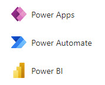
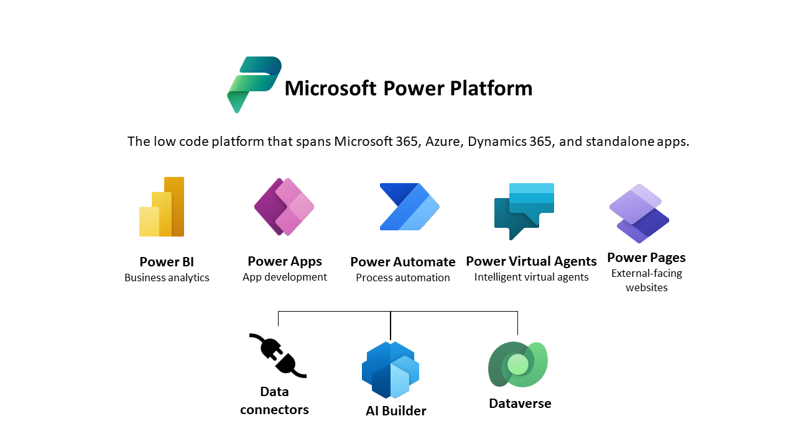
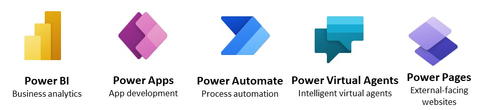
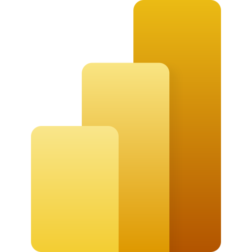
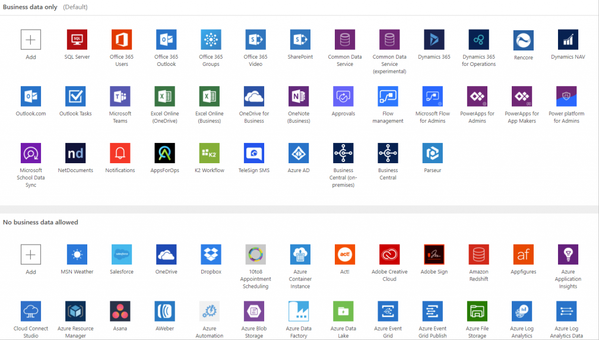
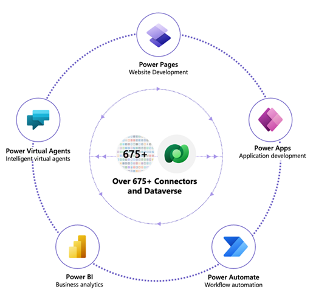
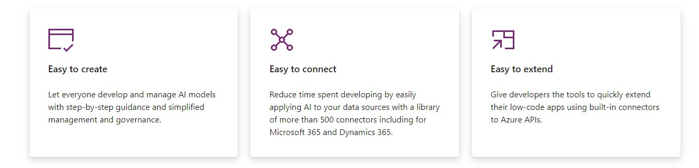
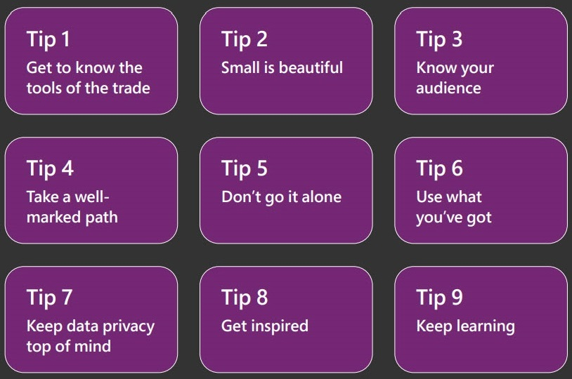
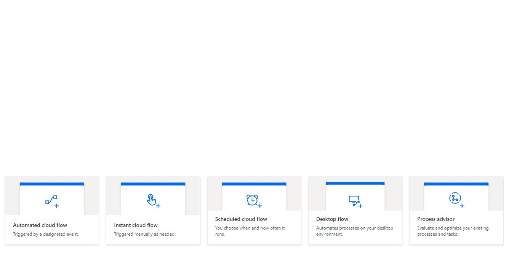

<!-- _color: white -->
# Introduktion til Microsoft Power Platform <!-- fit -->
## Webinar 07-12-2022 - Tue Hellstern

---

# Tue Hellstern

- Uddannet fra ITU
- Ekstern lektor på DTU
- Lektor på KEA
- Censor på Datamatiker, Akademiuddannelserne, PBA, Økonomi & IT og andre uddannelser

### Konsulent
- Selvstændig siden 1995
- Programmering, Databaser, Integration, Projekt styring
- Typisk større virksomheder

---

# Agenda
- Introduktion til Power Platform
- Demo Power Apps
- Demo Power Automate
- Demo Power BI

---

---

# Power Apps
- Hvor finder jeg de forskellige apps?
- Licens
- Office 365
- [app.powerbi.com](https://app.powerbi.com)
- [powerapps.microsoft.com](https://powerapps.microsoft.com)
- [powerautomate.microsoft.com](https://powerautomate.microsoft.com)
- [powerpages.microsoft.com](https://powerpages.microsoft.com)

---

# Power BI
- Business analytics
    - **Erstatning for Excel??**
- Opret
    - data-modeller
    - rapporter
    - dashboards
- Del på
    - Sharepoint
    - Teams
    - Apps
    - Websites

---

# Power Apps
- Udvikling af applikationer
- Browser "*format*"
- Mobil "*format*"
- Start med dine data 
    - *SharePoint List - Excel - Database*
- Start fra "*scratch*"

---

# Power Apps

- **No Code**
    - Drag and Drop - lidt lige som *PowerPoint*
- **Low Code**
    - Formler og funktioner lidt ligesom *Excel*
- **Code First**
    - Brug kode som du har oprettet

---

# Connectors
**Power Apps har 500+ connectors**

- [Microsoft Connector Reference](https://learn.microsoft.com/en-us/connectors/connector-reference/connector-reference-powerapps-connectors)

---

# Power Automate
- Opret automatiserede workflows
- Virker med apps og services
- Drag and Drop

---

# Power Virtual Agents
- Opret dine egne chatbots
- Dialog med dine bruger
- Drag and Drop

---

# Power Pages
Microsoft Power Pages er en SaaS-platform der giver dig mulighed for at oprette en data-centric webside med no-code tilgangen.

Med Power Pages kan du hurtigt designe, konfigurere og udgive dine websider. Du brugere **Design Studio** til at oprette dine websider.

Priser osv. kan du finde på: [powerpages.microsoft.com](https://powerpages.microsoft.com)

---

# AI Builder
- Artificial Intelligence
- Built-in
- Custom models
- Automatisering af processer
- Forudsigelser i forhold til data

---

# Dataverse
 Dataverse har standardtabeller, der dækker typiske business scenarier, men du kan også oprette brugerdefinerede tabeller, der er specifikke for din virksomheden og udfylde dem med data ved hjælp af Power Query.

- Azure database
- Optimeret for "*Business*"

---

<!-- _backgroundColor: #333333 -->
<!-- _color: white -->

# Microsoft 9 tips - Citizen Developer

---

<!-- _backgroundColor: black -->
<!-- _color: white -->
# Demo <!-- fit -->
# Power Apps - Start med en Excel Tabel

---

# Power Automate
5 typer af flows

---

# Links

- [Power BI](https://powerbi.microsoft.com/)
- [Power Apps](https://powerapps.microsoft.com/)
- [Power Pages](https://powerpages.microsoft.com)
- [Power Pages dokumentation](https://learn.microsoft.com/da-dk/power-pages/)
- [Power Automate](https://powerautomate.microsoft.com/)
- [Power Virtual Agents](https://powervirtualagents.microsoft.com/)
- [Microsoft Dataverse](https://learn.microsoft.com/en-us/power-apps/maker/data-platform/)
- [Blog](https://powerapps.microsoft.com/en-us/blog)